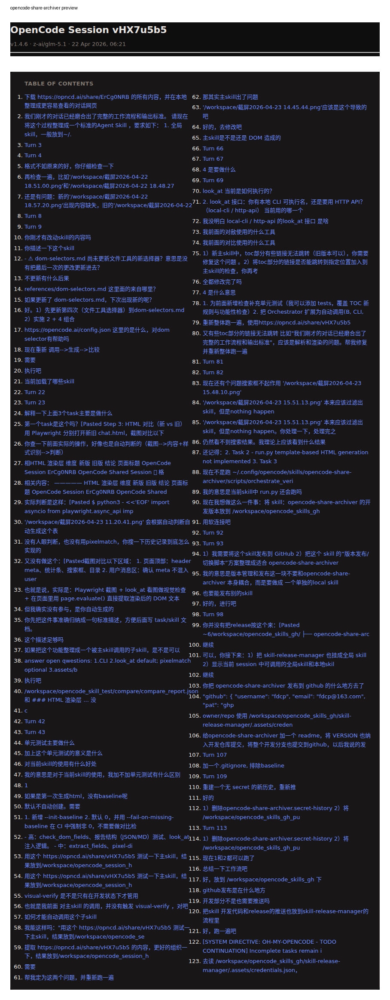

# opencode-share-archiver

Development branch for the OpenCode share archiver skill.

## What it does

This skill turns an `opncd.ai/share/<ID>` conversation into two local artifacts: a structured JSON archive and a self-contained HTML page for offline reading. It is meant for preserving valuable OpenCode sessions, making them searchable and reviewable offline, and verifying that the archived result still looks and behaves correctly over time.

It also supports archiving a local OpenCode session by session ID via `oc-archive`, which shares the session, archives the generated share URL, then removes the share link. Output is written to `<output_dir>/<session_id>/`.

## What this repo contains

- `scripts/run.py`: scrape a shared session and generate `conversation_final.json` + `chat.html`
- `scripts/orchestrate_verify.py`: run the full verify pipeline
- `subskills/visual-verify/`: DOM, screenshot, and visual regression checks
- `VERSION`: release version for this development branch

## Development flow

1. Edit in this repo.
2. Update `VERSION` when preparing a release.
3. Use `skill-release-manager` to package, publish, and switch the installed skill.
4. Run verification only from the release snapshot under `releases/opencode-share-archiver/vX.Y.Z/`.

## Notes

- This repository is the source of truth for development.
- The installed global skill points to a released snapshot.
